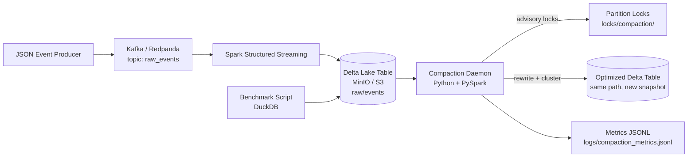

# Tiered Data Lakehouse Compaction Engine

> **Streaming ingestion meets automated table maintenance** — Kafka → Spark → Delta Lake on MinIO, with a Python compaction daemon that rewrites small-file partitions and logs before/after benchmarks.

A **local Docker portfolio project** (not a production deployment): demonstrates lakehouse ingestion, partition-scoped compaction, data quality quarantine, advisory locks, and measurable query/file-count impact. **75 unit tests** run without Docker; the full pipeline requires Docker Compose.

| What this is | What this is not |
|--------------|------------------|
| End-to-end lakehouse demo on MinIO + Redpanda | AWS EMR / MSK / production S3 deployment |
| Partition-level Delta overwrite + locks | Databricks `OPTIMIZE ZORDER` (uses sort-based approximation) |
| Checkpointed Spark streaming (at-least-once) | Guaranteed exactly-once without idempotent sink design |
| Sample benchmark numbers in `logs/examples/` | Fixed SLA or universal 3–5× speedup on your hardware |

[](https://github.com/vishnup22/data-lakehouse/actions/workflows/ci.yml)


[](LICENSE)

---

## Documentation

| Doc | Audience | Contents |
|-----|----------|----------|
| [**Architecture**](docs/ARCHITECTURE.md) | Engineers | System design, Mermaid diagram, failure modes, future work |
| [**Benchmark Report**](docs/BENCHMARK_REPORT.md) | Interview prep | Methodology + sample before/after results |
| [**Example outputs**](logs/examples/) | Reviewers | Sample metrics, benchmark report, JSON events |

---

## Table of contents

- [Screenshots & sample output](#screenshots--sample-output)
- [Architecture](#architecture)
- [The problem: small files](#the-problem-small-files)
- [The solution: compaction daemon](#the-solution-background-compaction-daemon)
- [Features](#features)
- [Why this matters in production](#why-this-matters-in-production)
- [Setup](#setup)
- [Compaction CLI](#compaction-cli-airflow--cron--dagster)
- [Compaction rules](#compaction-rules-defaults)
- [Expected output](#expected-output)
- [Troubleshooting](#troubleshooting)
- [Production improvements](#what-i-would-improve-in-production)
- [Project structure](#project-structure)
- [How to explain this in interviews](#how-to-explain-this-project-in-interviews)
- [License](#license)

---

## Screenshots & sample output

No cloud account required — run locally and capture these views, or review committed examples in [`logs/examples/`](logs/examples/).

| View | Where to find it |
|------|------------------|
| **Architecture** | Mermaid diagram below (renders on GitHub) |
| **MinIO console** | http://localhost:9001 — Parquet files under `lakehouse/raw/events` |
| **Spark UI** | http://localhost:8080 — streaming job stages |
| **Compaction dry-run** | `make compact-dry-run` — eligible partitions table |
| **Benchmark comparison** | `make benchmark` — before/after latency table |

### Compaction dry-run (terminal)

```
========================================================================================
  COMPACTION DRY RUN
========================================================================================
Partition                                  Files Now   Est. After     Size Now
---------------------------------------- ---------- ------------ ------------
event_date=2026-06-11/event_hour=10              87            4     12.00 MB
----------------------------------------------------------------------------------------
  Totals: 1 partition(s) | files 87 -> 4 (estimated) | no data rewritten (dry-run)
========================================================================================
```

### Benchmark before vs after (sample run — see `logs/examples/`)

```
==========================================================================================
  BENCHMARK COMPARISON: BEFORE vs AFTER COMPACTION
==========================================================================================
  Files:      87  -->       4  (-95.4% files)
  Size:    12.00 MB  -->   11.34 MB
==========================================================================================
Query                            Before (s)   After (s)     Change    Speedup
------------------------------ ------------ ------------ ---------- ----------
filter_by_region                     0.2310       0.0670     -71.0%      3.45x
count_by_event_type                  0.8420       0.1980     -76.5%      4.25x
parquet_file_inventory               0.0430       0.0080     -81.4%      5.38x
==========================================================================================
```

### Committed examples (no run required)

- [`logs/examples/compaction_metrics.jsonl`](logs/examples/compaction_metrics.jsonl) — run summary JSON
- [`logs/examples/benchmark_report.md`](logs/examples/benchmark_report.md) — full Markdown report
- [`logs/examples/sample_events.json`](logs/examples/sample_events.json) — Kafka payload shape + quarantine example

---

## Architecture

> Design deep-dive: [docs/ARCHITECTURE.md](docs/ARCHITECTURE.md)



**Data flow:** A Python producer generates JSON events and publishes them to Kafka. Spark Structured Streaming consumes the topic, parses JSON, adds partition columns (`event_date`, `event_hour`), and appends to a Delta table on MinIO. The compaction daemon scans that table hourly (or on demand), compacts eligible partitions, and logs metrics. A benchmark script measures file count and query runtime to show the before/after impact.

---

## The Problem: Small Files

In a streaming pipeline, Spark often writes one or more Parquet files per micro-batch. With a short trigger interval (this project uses **10 seconds**), a single hourly partition can accumulate **dozens or hundreds of files**, many of them only a few kilobytes.

That creates real costs:

- **Slower queries** — Spark, DuckDB, and other engines open and plan against every file. More files means more overhead before any useful work begins.
- **More S3 API calls** — Listing and reading thousands of objects adds latency and cost.
- **Weaker compression** — Parquet works best with larger row groups; tiny files cannot compress or encode columns efficiently.
- **Growing maintenance debt** — The longer streaming runs without compaction, the more expensive each cleanup job becomes.

This is one of the most common operational issues in lakehouse architectures. It does not mean streaming is wrong — it means you need a **table maintenance strategy** alongside ingestion.

---

## The Solution: Background Compaction Daemon

The compaction daemon is a modular Python service that runs on a schedule (default: every hour) or in one-shot mode (`--once`). Each cycle follows these steps:

1. **Scan partitions** — List Parquet files under the Delta table prefix in MinIO/S3, grouped by `event_date` and `event_hour`.
2. **Detect small files** — A file is "small" if it is under **32 MB**. A partition is eligible if it has **>20 small files** or **>100 total files**.
3. **Skip active partitions** — Partitions written to in the last **30 minutes** are skipped so compaction does not race with live streaming.
4. **Acquire a partition lock** — An advisory lock at `locks/compaction/{partition_id}.lock` (with `owner_id`, `expires_at`, `run_id`) prevents two workers from rewriting the same partition. Stale locks are cleaned up automatically.
5. **Rewrite and cluster** — PySpark reads the partition, repartitions toward **~128 MB** files, and applies **Z-order inspired clustering** (sort by `user_id`, `account_id`, `event_timestamp`). Open-source Delta builds may not support Databricks `OPTIMIZE ZORDER`; this approach is a portable approximation. Native `OPTIMIZE` can be enabled via `USE_DELTA_OPTIMIZE=true` when available.
6. **Commit via Delta ACID** — The rewrite uses Delta `overwrite` with `replaceWhere` for the target partition only. File removal is handled through the Delta transaction log — files are never deleted manually from S3.
7. **Emit metrics** — Structured logs and a JSONL metrics file record files/bytes before and after, duration, skipped partitions, and lock conflicts.

### Why readers are not blocked

Delta Lake uses **MVCC (multi-version concurrency control)**. While compaction runs, readers continue querying the previous snapshot. New files are written and a transaction is appended to `_delta_log`; on commit, new readers see the optimized version atomically. Streaming ingestion to other partitions is unaffected.

### How the daemon avoids concurrent compaction conflicts

Compaction runs can overlap — a scheduled daemon, a manual `--once` run, or a restarted container after a crash. This project uses **partition-level advisory locks** to coordinate without blocking the whole table.

**Lock file location:** `locks/compaction/{partition_id}.lock`

Example: `locks/compaction/event_date=2024-06-11/event_hour=12.lock`

**Lock file contents (JSON):**

```json
{
  "partition_id": "event_date=2024-06-11/event_hour=12",
  "owner_id": "compactor-a1b2c3d4",
  "acquired_at": "2026-06-11T14:00:02Z",
  "expires_at": "2026-06-11T15:00:02Z",
  "run_id": "f3a91bc204e1"
}
```

**How it works:**

1. **Acquire before compact** — A worker writes a lock file before rewriting a partition. If another worker holds a non-expired lock, the partition is skipped and counted as a `lock_conflict`.
2. **Stale lock cleanup** — If a worker crashes mid-run, its lock would block compaction forever. Locks carry an `expires_at` timestamp; the next daemon cycle removes expired locks and logs `stale_lock_cleaned`.
3. **Always release in `finally`** — Even when Spark compaction fails, the lock is released so the partition can be retried later. Failed partitions are logged; other partitions in the same run continue.
4. **Delta ACID is the safety net** — Locks prevent duplicate *effort*, not data corruption. Rewrites use Delta `overwrite` + `replaceWhere`; superseded files are removed via the transaction log only — never manual S3 deletes.

**Interview talking point:** Advisory locks + MVCC + partition-scoped overwrite = safe maintenance at scale without global table locks.

### Data quality and quarantine handling

Production pipelines should not land bad data silently in the raw table. The Spark streaming job validates every Kafka message **before** it reaches the raw Delta table.

**Required fields:** `event_id`, `user_id`, `account_id`, `event_timestamp`, `event_type`

**Routing:**
- Valid records → `s3a://lakehouse/raw/events`
- Invalid records → `s3a://lakehouse/quarantine/events` (with `rejection_reason` and `json_value`)

**Rejection reasons:**

| Reason | Example |
|--------|---------|
| `missing_event_id` | Payload omits `event_id` |
| `null_event_timestamp` | `event_timestamp` is null or unparseable |
| `invalid_amount` | `amount` is `"not-a-number"` or negative |
| `malformed_json` | Truncated / invalid JSON |

The producer injects ~2% bad events by default (`BAD_EVENT_RATE=0.02`) so you can demo quarantine in local runs.

**Quality metrics** (`logs/quality_metrics.jsonl`) per micro-batch:

```json
{
  "record_type": "quality_metrics",
  "batch_id": 12,
  "valid_record_count": 490,
  "bad_record_count": 10,
  "bad_record_percentage": 2.0,
  "total_record_count": 500
}
```

Streaming stdout also prints: `[quality] batch=12 valid=490 bad=10 bad_pct=2.0%`

---

## Features

| Area | What this project demonstrates |
|------|-------------------------------|
| **Kafka streaming ingestion** | JSON events published to `raw_events` via a Python producer; Redpanda provides a Kafka-compatible broker for local dev |
| **Data quality validation** | Required-field checks with quarantine routing and per-batch quality metrics |
| **Spark Structured Streaming** | Continuous Kafka → Delta pipeline with checkpointing and partition columns |
| **Delta Lake table format** | ACID appends from streaming; transaction-safe partition overwrite for compaction |
| **S3-compatible object storage** | MinIO stands in for S3; paths use the `s3a://` protocol |
| **Python daemon** | Scheduled background service with `--once` manual mode and graceful shutdown |
| **Partition-level locking** | Advisory locks per partition to avoid duplicate compaction work |
| **Stale lock cleanup** | Abandoned locks expire after a configurable timeout |
| **Z-order inspired clustering** | Sort + repartition to colocate related rows for better filter performance |
| **Benchmarking** | Five SQL queries + file inventory; before/after comparison table, JSONL results, and Markdown report |
| **Structured JSON logging** | Every daemon event emits a JSON log line with an `event` field for grep/jq and interview demos |
| **Metrics logging** | Per-run JSONL summaries at `logs/compaction_metrics.jsonl` with files, bytes, duration, and failures |
| **Unit tests** | pytest coverage for data quality, eligibility rules, target file sizing, locks, failure recovery, and config |

---

## Why This Matters in Production

In a real lakehouse, ingestion and maintenance are separate concerns. Engineers often focus on getting data in quickly — which is correct — but without compaction, query performance degrades silently over weeks. Production teams typically run **OPTIMIZE**, **VACUUM**, or custom compaction jobs on a schedule, guarded by partition age rules and concurrency controls.

This project shows that you understand:

- How streaming write patterns create operational debt
- Why Delta ACID semantics matter for safe rewrites
- How to avoid blocking readers during maintenance
- How to add locks, metrics, and eligibility rules so compaction is safe to run unattended

That is the kind of thinking hiring managers look for in junior data engineers: not just building a pipeline, but keeping it **fast and reliable over time**.

---

## Setup

### Prerequisites

- Docker Desktop (or Docker Engine) + Docker Compose v2
- Make (Git Bash on Windows, or WSL)
- Python 3.11+ (for `make test` only — everything else runs in Docker)

### Docker services

| Service | Purpose | Port (host) |
|---------|---------|-------------|
| `redpanda` | Kafka-compatible broker | `19092` |
| `minio` | S3-compatible storage | `9000` (API), `9001` (console) |
| `spark` | Spark master | `8080` (UI), `7077` (master) |
| `compactor` | Background compaction daemon | — |
| `producer` | Event generator (`make produce`) | — |
| `streaming` | Spark streaming job (`make stream`) | — |

### Quick start — interview demo (~20 min)

Uses `.env.demo` (lower eligibility thresholds, 2-minute age guard). **Stop streaming** before compacting — the age guard skips partitions written in the last N minutes.

```bash
make demo-env          # copy .env.demo → .env
make up
make produce           # terminal 2
make stream            # terminal 3 — run ~10 min, then Ctrl+C
make wait-eligible     # waits 3 min (covers 2 min age guard)
make benchmark-before
make compact-once
make benchmark-after
make benchmark-compare # prints before/after table
```

### Quick start — default thresholds (slower)

Default rules need **>20 small files** and a **30-minute age guard**. Practical flow: stream 30+ min, **stop streaming**, wait 30+ min, then compact.

```bash
cp .env.example .env
make up && make produce && make stream
# stop streaming, wait 30+ min
make compact-dry-run   # verify eligible partitions first
make benchmark-before && make compact-once && make benchmark-after && make benchmark-compare
```

### All Makefile commands

| Command | Description |
|---------|-------------|
| `make up` | Start Redpanda, MinIO, Spark, compactor |
| `make down` | Stop all services and remove volumes |
| `make logs` | Tail logs (compactor, spark, streaming, redpanda, minio) |
| `make produce` | Run Kafka event producer |
| `make stream` | Start Spark Structured Streaming job |
| `make compact-once` | Run one compaction cycle |
| `make compact-dry-run` | Scan only — no writes |
| `make demo-env` | Copy `.env.demo` for faster local demos |
| `make benchmark-before` | Snapshot query latency (pre-compaction) |
| `make benchmark-after` | Snapshot query latency (post-compaction) |
| `make benchmark-compare` | Print before/after comparison |
| `make wait-eligible` | Sleep through partition age guard (demo) |
| `make status` | `docker compose ps` |
| `make test` | Run pytest locally |
| `make lint` | Ruff lint + format check |
| `make typecheck` | Mypy on `src/` (Spark modules excluded) |
| `make ci` | Full local CI: lint + typecheck + test |
| `make clean` | Remove logs, locks, and orphan containers |

### Testing & CI

GitHub Actions runs on every push/PR to `main` (see [`.github/workflows/ci.yml`](.github/workflows/ci.yml)):

1. `pip install -r requirements.txt` + `requirements-dev.txt` (no Docker, no PySpark)
2. `ruff check .` and `ruff format --check .`
3. `mypy src`
4. `pytest` — **75 unit tests**, no external services

```bash
pip install -r requirements.txt -r requirements-dev.txt
make ci
```

| Test module | What it covers |
|-------------|----------------|
| `test_file_scanner.py` | Small-file detection, partition stats |
| `test_partition_selection.py` | Age guard, eligibility rules, skip reasons |
| `test_target_file_sizing.py` | Target output file count (~128 MB) |
| `test_lock_manager.py` | Acquire/release, stale lock cleanup, failure recovery |
| `test_compaction_rules.py` | Config loading, env aliases, MB→bytes |
| `test_data_quality.py` | Required fields, quarantine reasons, metrics |

### Environment variables (`.env.example`)

Key settings for local dev:

```bash
AWS_ACCESS_KEY_ID=minioadmin
AWS_SECRET_ACCESS_KEY=minioadmin
S3_ENDPOINT=http://localhost:9000
RAW_TABLE_PATH=s3a://lakehouse/raw/events
CHECKPOINT_PATH=s3a://lakehouse/checkpoints/raw_events
COMPACTION_INTERVAL_SECONDS=3600
SMALL_FILE_THRESHOLD_MB=32
TARGET_FILE_SIZE_MB=128
```

**Docker networking:** `docker-compose.yml` overrides `S3_ENDPOINT` and `KAFKA_BOOTSTRAP_SERVERS` inside containers (`http://minio:9000`, `redpanda:9092`). Your `.env` can keep `localhost` for host-side tools; services in Compose get the internal hostnames.

---

## Compaction CLI (Airflow / cron / Dagster)

The compactor exits with orchestrator-friendly codes:

| Exit code | Meaning |
|-----------|---------|
| `0` | Success — compaction completed or dry-run found eligible work |
| `1` | Failure — error, missing table, or all compactions failed |
| `2` | No eligible partitions — table is healthy, nothing to do |

**CLI commands:**

```bash
# Single scheduled run (use in Airflow BashOperator or cron)
python -m src.compactor.compaction_daemon --once

# Long-running service (Docker / systemd)
python -m src.compactor.compaction_daemon --daemon

# Plan only — scan, show eligible partitions, estimate file counts
python -m src.compactor.compaction_daemon --dry-run

# Compact one partition (backfill / targeted maintenance)
python -m src.compactor.compaction_daemon --once \
  --partition event_date=2026-06-11/event_hour=10
```

**Dry-run output example:**

```
========================================================================================
  COMPACTION DRY RUN
========================================================================================
Partition                                  Files Now   Est. After     Size Now
---------------------------------------- ---------- ------------ ------------
event_date=2026-06-11/event_hour=10              87            4     12.00 MB
----------------------------------------------------------------------------------------
  Totals: 1 partition(s) | files 87 -> 4 (estimated) | no data rewritten (dry-run)
========================================================================================
```

**Airflow example:**

```python
from airflow.operators.bash import BashOperator

compact_raw_events = BashOperator(
    task_id="compact_raw_events",
    bash_command="python -m src.compactor.compaction_daemon --once",
    # exit code 2 (no eligible partitions) can be treated as success via soft_fail
)
```

**Cron example:**

```cron
0 * * * * cd /workspace && python -m src.compactor.compaction_daemon --once >> /var/log/compaction.log 2>&1
```

---

## Compaction Rules (Defaults)

| Rule | Value | Description |
|------|-------|-------------|
| Small file threshold | 32 MB | Files below this count as "small" |
| Small file count | > 20 | Partition eligible when exceeded |
| Total file count | > 100 | Partition eligible when exceeded |
| Target output size | ~128 MB | Repartition target during rewrite |
| Partition age skip | 30 min | Do not compact actively-written partitions |
| Lock timeout | 3600 s | Stale locks removed automatically |

---

## Expected Output

### Structured JSON logs (stdout)

Each log line is a JSON object with an `event` field — easy to grep, pipe to jq, or show in interviews. Set `LOG_JSON_FORMAT=false` in `.env` for plain-text logs.

```json
{"timestamp": "2026-06-11T14:00:01Z", "level": "INFO", "event": "partition_scan_complete", "run_id": "a3f8b2c1d4e5", "partitions_scanned": 3, "eligible_partitions": 1, "skipped_partitions": 2}
{"timestamp": "2026-06-11T14:00:02Z", "level": "INFO", "event": "lock_acquired", "partition_id": "event_date=2024-06-11/event_hour=12", "owner_id": "compactor-abc12345"}
{"timestamp": "2026-06-11T14:00:14Z", "level": "INFO", "event": "partition_compaction_complete", "partition_id": "event_date=2024-06-11/event_hour=12", "files_before": 87, "files_after": 4, "bytes_before_human": "12.00 MB", "bytes_after_human": "11.34 MB", "duration_seconds": 12.4, "method": "zorder_inspired"}
{"timestamp": "2026-06-11T14:00:15Z", "level": "INFO", "event": "compaction_run_complete", "run_id": "a3f8b2c1d4e5", "status": "success", "files_before": 87, "files_after": 4, "bytes_before_human": "12.00 MB", "bytes_after_human": "11.34 MB", "compaction_duration_seconds": 14.5, "lock_conflicts": 0, "failed_partitions": []}
```

**Error events** are also structured — useful for explaining failure handling:

```json
{"timestamp": "2026-06-11T14:00:02Z", "level": "WARNING", "event": "lock_acquisition_failed", "partition_id": "event_date=2024-06-11/event_hour=11", "holder": "worker-b-1a2b3c4d", "requester": "compactor-abc12345"}
{"timestamp": "2026-06-11T14:00:02Z", "level": "WARNING", "event": "stale_lock_cleaned", "partition_id": "event_date=2024-06-11/event_hour=10", "previous_owner": "crashed-worker", "lock_age_seconds": 4200.0}
{"timestamp": "2026-06-11T14:00:01Z", "level": "ERROR", "event": "table_not_found", "table_path": "s3a://lakehouse/raw/events", "error": "Delta table not found..."}
```

### Metrics file (`logs/compaction_metrics.jsonl`)

One JSON line per compaction run (`record_type: compaction_run_summary`). Sample: [`logs/examples/compaction_metrics.jsonl`](logs/examples/compaction_metrics.jsonl).

```json
{
  "record_type": "compaction_run_summary",
  "run_id": "a3f8b2c1d4e5",
  "table_path": "s3a://lakehouse/raw/events",
  "started_at": "2026-06-11T14:00:00Z",
  "completed_at": "2026-06-11T14:00:15Z",
  "status": "success",
  "partitions_scanned": 3,
  "eligible_partitions": 1,
  "skipped_partitions": 2,
  "compacted_partitions": 1,
  "files_before": 87,
  "files_after": 4,
  "files_reduced": 83,
  "bytes_before": 12582912,
  "bytes_after": 11892032,
  "bytes_before_human": "12.00 MB",
  "bytes_after_human": "11.34 MB",
  "bytes_before_mb": 12.0,
  "bytes_after_mb": 11.34,
  "compaction_duration_seconds": 14.5,
  "lock_conflicts": 0,
  "failed_partitions": [],
  "partition_details": [
    {
      "partition_id": "event_date=2024-06-11/event_hour=12",
      "files_before": 87,
      "files_after": 4,
      "bytes_before_human": "12.00 MB",
      "bytes_after_human": "11.34 MB",
      "duration_seconds": 12.4,
      "method": "zorder_inspired",
      "status": "success"
    }
  ]
}
```

### Benchmark — single run (before compaction)

```
==============================================================================
  BENCHMARK RUN — BEFORE COMPACTION
  benchmark_id: f3a91bc204e1  |  engine: duckdb
  Parquet files: 87  |  Data size: 12.00 MB
==============================================================================
Query                            Runtime (s)     Rows
-------------------------------- ------------ --------
count_by_event_type                    0.8420        7
filter_by_region                       0.2310      142
aggregate_by_region_date               0.5190       35
count_total_records                    0.1840        1
parquet_file_inventory                 0.0430       87
==============================================================================
```

### Benchmark — before vs after comparison

```
==========================================================================================
  BENCHMARK COMPARISON: BEFORE vs AFTER COMPACTION
==========================================================================================
  Files:      87  -->       4  (-95.4% files)
  Size:    12.00 MB  -->   11.34 MB
==========================================================================================
Query                            Before (s)   After (s)     Change    Speedup
------------------------------ ------------ ------------ ---------- ----------
aggregate_by_region_date             0.5190       0.1420     -72.6%      3.65x
count_by_event_type                  0.8420       0.1980     -76.5%      4.25x
count_total_records                  0.1840       0.0510     -72.3%      3.61x
filter_by_region                     0.2310       0.0670     -71.0%      3.45x
parquet_file_inventory               0.0430       0.0080     -81.4%      5.38x
==========================================================================================
```

**Why this happens:** Query engines pay a per-file cost (S3 metadata, Parquet footer reads, task scheduling). Compaction collapses 87 files into 4 larger files with bigger row groups, so the same SQL spends less time on orchestration and more on actual column reads.

### Benchmark results (`logs/benchmark_results.jsonl`)

```json
{
  "record_type": "benchmark_run",
  "benchmark_id": "f3a91bc204e1",
  "phase": "after",
  "timestamp": "2026-06-11T15:30:00Z",
  "engine": "duckdb",
  "input_file_count": 4,
  "total_data_size_mb": 11.34,
  "table_path": "s3a://lakehouse/raw/events",
  "queries": [
    {
      "query_name": "count_by_event_type",
      "runtime_seconds": 0.198,
      "input_file_count": 4,
      "total_data_size_mb": 11.34,
      "timestamp": "2026-06-11T15:30:01Z",
      "row_count": 7
    }
  ]
}
```

### Benchmark report (`logs/benchmark_report.md`)

Auto-generated Markdown with before/after tables and a comparison section. A committed sample is at [`logs/examples/benchmark_report.md`](logs/examples/benchmark_report.md); live runs overwrite `logs/benchmark_report.md`.

---

## Troubleshooting

### MinIO not reachable

**Symptoms:** `Connection refused` to `localhost:9000`, Spark S3A errors, compactor `table_not_found`.

**Fixes:**
1. Confirm MinIO is healthy: `docker compose ps` — `minio` should be `healthy`
2. Open the console: http://localhost:9001 (login: `minioadmin` / `minioadmin`)
3. Re-run bucket init: `make init-bucket`
4. Inside containers use `http://minio:9000`; from your host use `http://localhost:9000`
5. Check `.env` — `S3_ENDPOINT` / `AWS_ACCESS_KEY_ID` must match `MINIO_ROOT_USER` / `MINIO_ROOT_PASSWORD`

### Kafka topic missing / producer cannot connect

**Symptoms:** `LEADER_NOT_AVAILABLE`, producer hangs, streaming job has no data.

**Fixes:**
1. Wait for Redpanda healthcheck: `docker compose ps redpanda`
2. Redpanda auto-creates topics — ensure producer points to `localhost:19092` on the host
3. Create topic manually:
   ```bash
   docker compose exec redpanda rpk topic create raw_events
   ```
4. Verify: `docker compose exec redpanda rpk topic list`

### Spark package download errors

**Symptoms:** `spark-submit` fails resolving `io.delta:delta-spark` or `hadoop-aws` jars.

**Fixes:**
1. First `make stream` run downloads packages — allow 2–5 minutes on slow networks
2. Packages are cached in the `spark_ivy` Docker volume
3. Retry: `make down && make up && make stream`
4. Alternative attach mode: `make stream-exec` (runs inside the `spark` container)
5. Check corporate proxy — set `HTTP_PROXY` / `HTTPS_PROXY` in `docker-compose.yml` if needed

### Delta Lake dependency issues

**Symptoms:** `ClassNotFoundException: io.delta.sql.DeltaSparkSessionExtension`, `DeltaTable` not found.

**Fixes:**
1. Ensure `spark-streaming-submit.sh` includes Delta packages (used by `make stream`)
2. Compactor image bundles Delta jars in `/opt/spark/jars-extra` (see `Dockerfile`)
3. Spark and compactor both target **Spark 3.5.1 + Delta 3.1.0** — version mismatch causes failures
4. Rebuild compactor: `docker compose build compactor --no-cache`

### Permission / lock errors

**Symptoms:** `lock_acquisition_failed`, cannot write to `logs/` or `locks/`.

**Fixes:**
1. Ensure `logs/` and `locks/` directories exist and are writable
2. On Windows + OneDrive, file locking can conflict — pause sync or move the project outside OneDrive
3. Clear stale locks: `make clean` or delete `locks/compaction/*.lock`
4. Check compactor logs: `docker compose logs compactor`

### No eligible partitions for compaction

**Symptoms:** `make compact-once` exits with code `2`, dry-run shows no rows.

**Fixes:**
1. **Stop streaming first** — the age guard skips partitions written within `PARTITION_AGE_SKIP_MINUTES` (30 by default, 2 in `.env.demo`)
2. Run `make wait-eligible` after stopping streaming (demo), or wait 30+ min (default `.env`)
3. Need enough micro-batches: default rules require **>20 small files** or **>100 total files** per partition — use `make demo-env` for faster eligibility
4. Preview: `make compact-dry-run`

### General diagnostics

```bash
docker compose ps                  # service health
make logs                          # aggregated logs
docker compose logs spark          # Spark master only
docker compose exec compactor python -m src.compactor.compaction_daemon --dry-run
```

---

## What I Would Improve in Production

This project is intentionally scoped for local Docker development. In a production environment, I would extend it with:

- **Airflow or Dagster scheduling** — Replace the simple sleep loop with an orchestrator that manages dependencies, retries, and SLAs across compaction and downstream jobs.
- **Prometheus and Grafana metrics** — Export compaction duration, files reduced, lock conflicts, and failure rates to a real observability stack instead of JSONL files alone.
- **Iceberg or Delta table maintenance policies** — Formalize retention, `VACUUM`, and snapshot expiration; evaluate Iceberg if the org needs multi-engine commit compatibility.
- **Retry queues** — Failed partition compactions should land in a dead-letter or retry queue rather than being logged and dropped.
- **Data quality checks** — Validate row counts and checksums before and after rewrite to catch silent data loss.
- **Cloud deployment** — Run Spark streaming on **AWS EMR** or **EKS**, use **MSK** for Kafka, **S3** for storage, and trigger compaction via **Glue** jobs or a containerized daemon on **EKS** with IAM roles instead of static credentials.

---

## Project Structure

```
.github/workflows/ci.yml           # GitHub Actions: ruff, mypy, pytest
docs/
├── ARCHITECTURE.md                # System design document
└── BENCHMARK_REPORT.md            # Benchmark methodology
logs/examples/                     # Committed sample outputs (portfolio)
scripts/spark-streaming-submit.sh  # Spark submit wrapper
src/
├── producer/                      # Kafka JSON event generator
├── streaming/                     # Kafka → Delta + data quality
├── compactor/                     # Daemon, locks, compaction, metrics
├── benchmark/                     # DuckDB before/after benchmark
└── utils/                         # Structured JSON logging
tests/                             # 77 unit tests (no Docker)
```

---

## How to explain this project in interviews

### 30-second elevator pitch

> "I built a local streaming lakehouse: Kafka into Delta on MinIO, with a compaction daemon that rewrites noisy partitions to ~128 MB files using Delta ACID overwrite. I added partition locks, quarantine routing, and DuckDB benchmarks. In my sample run — committed under logs/examples — file count dropped from 87 to 4 and several queries were roughly 3–5× faster on my laptop; your numbers will vary."

### Problem → solution narrative

1. **Problem:** Streaming writes one Parquet file per micro-batch → hundreds of tiny files per hour → slow queries and high metadata overhead.
2. **Insight:** Ingestion and maintenance are separate concerns in real lakehouses (like Databricks OPTIMIZE on a schedule).
3. **Solution:** Partition-scoped compaction with eligibility rules, age guard, locks, and Delta `overwrite` + `replaceWhere`.
4. **Proof:** JSONL metrics + DuckDB benchmark with committed examples in [`logs/examples/`](logs/examples/).

### Technical talking points

| Topic | What to say |
|-------|-------------|
| **Delta ACID** | Rewrites commit atomically via `_delta_log`; readers use MVCC and stay on old snapshots until commit |
| **Partition locks** | Advisory JSON locks in S3 prevent duplicate effort; stale TTL handles crashed workers; Delta provides correctness |
| **Age guard** | Skip partitions written in last 30 minutes so compaction does not race live streaming |
| **128 MB target** | Balances Parquet row-group size, S3 object count, and Spark task overhead |
| **Data quality** | Bad records route to quarantine table with rejection reasons — not silent drops |
| **Orchestration** | CLI exit codes 0/1/2 for Airflow, cron, or Dagster |

### Resume bullets

- Built a **Delta Lake compaction daemon** in Python that detects small-file partitions in S3-compatible storage, rewrites them into ~128 MB files, and commits via ACID transactions without blocking concurrent readers
- Designed an end-to-end **Kafka → Spark Structured Streaming → Delta Lake** pipeline on Docker (Redpanda, MinIO, Spark) to demonstrate the small-file problem and a production-style remediation
- Implemented **partition-level locking**, Z-order inspired clustering, JSONL metrics, pytest CI, and before/after benchmarking to show safe, observable table maintenance

### Questions you should be ready for

- *"What if compaction fails mid-run?"* — Lock expires; uncommitted Parquet is ignored; `finally` releases lock; next cycle retries.
- *"What if two compactors run?"* — Second worker gets lock conflict, skips partition, logs metric.
- *"Why not delete files from S3 directly?"* — Breaks Delta MVCC; obsolete files removed only through transaction log.
- *"How is this different from Databricks OPTIMIZE?"* — Same goal; open-source Delta uses repartition + sort (Z-order inspired); native OPTIMIZE optional via env flag.

### 5-minute live demo script

1. Show architecture Mermaid diagram (above).
2. `make compact-dry-run` or show dry-run terminal output.
3. Open [`logs/examples/benchmark_report.md`](logs/examples/benchmark_report.md).
4. Mention `make ci` — 75 tests, no Docker.

---

## License

[MIT](LICENSE) — built for portfolio and interview demonstration.
