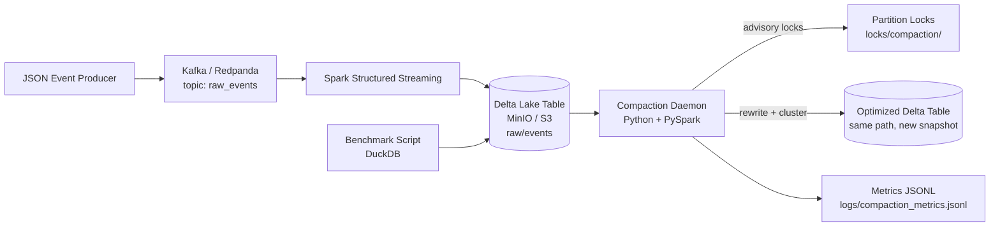

# Tiered Data Lakehouse Compaction Engine

Kafka → Spark Structured Streaming → Delta Lake on MinIO, with a Python compaction daemon that detects small-file partitions, rewrites them through Delta ACID transactions, and records before/after benchmarks.

Local Docker stack: Redpanda, MinIO, Spark 3.5, Delta Lake 3.1. Unit tests run without Docker; the full pipeline uses Docker Compose.

[](https://github.com/vishnup22/data-lakehouse/actions/workflows/ci.yml)


[](LICENSE)

## Documentation

- [Architecture](docs/ARCHITECTURE.md) — system design, data flow, failure modes
- [Benchmark methodology](docs/BENCHMARK_REPORT.md) — how before/after runs are measured
- [Example outputs](logs/examples/) — sample metrics, benchmark report, JSON events

## Architecture



A Python producer publishes JSON events to Kafka. Spark Structured Streaming consumes the topic, validates records, adds partition columns (`event_date`, `event_hour`), and appends to a Delta table on MinIO. Invalid records route to a quarantine table. The compaction daemon scans partitions on a schedule, rewrites eligible slices, and writes metrics. A benchmark script measures file counts and query latency before and after compaction.

## Small-file problem

Spark Structured Streaming writes one or more Parquet files per micro-batch. With a 10-second trigger, an hourly partition can accumulate dozens of small files. That increases query planning overhead, S3 LIST cost, and maintenance work over time.

## Compaction daemon

Each cycle:

1. Scan partitions under the Delta table prefix (`event_date`, `event_hour`)
2. Mark partitions eligible when they have **>20 small files** (<32 MB) or **>100 total files**
3. Skip partitions written within the last **30 minutes** (configurable)
4. Acquire an advisory lock at `locks/compaction/{partition_id}.lock`
5. Rewrite via PySpark — repartition toward **~128 MB**, sort by `user_id`, `account_id`, `event_timestamp`
6. Commit with Delta `overwrite` + `replaceWhere` (no manual S3 deletes)
7. Write run metrics to `logs/compaction_metrics.jsonl`

Delta MVCC lets readers stay on the previous snapshot while compaction runs. Locks coordinate workers; Delta provides correctness.

### Data quality

Required fields: `event_id`, `user_id`, `account_id`, `event_timestamp`, `event_type`

| Route | Path |
|-------|------|
| Valid | `s3a://lakehouse/raw/events` |
| Invalid | `s3a://lakehouse/quarantine/events` |

Rejection reasons: `missing_event_id`, `null_event_timestamp`, `invalid_amount`, `malformed_json`, and others. Quality metrics append to `logs/quality_metrics.jsonl` per micro-batch.

## Features

| Component | Description |
|-----------|-------------|
| Producer | JSON events to Kafka (`raw_events`) |
| Streaming | Spark Structured Streaming → Delta with checkpoints |
| Compactor | Scheduled or one-shot partition rewrite |
| Locks | Per-partition advisory locks with stale cleanup |
| Benchmark | DuckDB queries + file inventory, before/after report |
| CI | ruff, mypy, pytest (77 tests, no Docker) |

## Setup

### Prerequisites

- Docker Desktop + Docker Compose v2
- Make (Git Bash on Windows, or WSL)
- Python 3.11+ (for local `make test` / `make ci`)

### Services

| Service | Port |
|---------|------|
| Redpanda (Kafka) | `19092` |
| MinIO API / console | `9000` / `9001` |
| Spark UI | `8080` |

### Quick start (demo thresholds, ~20 min)

```bash
make demo-env
make up
make produce           # terminal 2
make stream            # terminal 3 — ~10 min, then Ctrl+C
make wait-eligible
make benchmark-before
make compact-once
make benchmark-after
make benchmark-compare
```

Stop streaming before compacting — the age guard skips recently written partitions.

### Quick start (default thresholds)

```bash
cp .env.example .env
make up && make produce && make stream
# stop streaming, wait 30+ min for age guard
make compact-dry-run
make benchmark-before && make compact-once && make benchmark-after && make benchmark-compare
```

### Makefile commands

| Command | Description |
|---------|-------------|
| `make up` / `make down` | Start / stop stack |
| `make produce` | Kafka event producer |
| `make stream` | Spark streaming job |
| `make compact-once` | One compaction cycle |
| `make compact-dry-run` | Scan only, no writes |
| `make demo-env` | Copy `.env.demo` (lower thresholds) |
| `make benchmark-before` / `make benchmark-after` | Snapshot query latency |
| `make benchmark-compare` | Print before/after table |
| `make test` / `make ci` | pytest / full local CI |

### Environment

```bash
AWS_ACCESS_KEY_ID=minioadmin
AWS_SECRET_ACCESS_KEY=minioadmin
S3_ENDPOINT=http://localhost:9000
RAW_TABLE_PATH=s3a://lakehouse/raw/events
CHECKPOINT_PATH=s3a://lakehouse/checkpoints/raw_events
SMALL_FILE_THRESHOLD_MB=32
TARGET_FILE_SIZE_MB=128
```

Inside Docker, `docker-compose.yml` overrides endpoints to `http://minio:9000` and `redpanda:9092`.

### CI

```bash
pip install -r requirements.txt -r requirements-dev.txt
make ci
```

GitHub Actions runs ruff, mypy, and pytest on every push to `main`.

## Compaction CLI

| Exit code | Meaning |
|-----------|---------|
| `0` | Success |
| `1` | Failure |
| `2` | No eligible partitions |

```bash
python -m src.compactor.compaction_daemon --once
python -m src.compactor.compaction_daemon --daemon
python -m src.compactor.compaction_daemon --dry-run
python -m src.compactor.compaction_daemon --once --partition event_date=2026-06-11/event_hour=10
```

## Default compaction rules

| Rule | Value |
|------|-------|
| Small file threshold | 32 MB |
| Small file count trigger | > 20 |
| Total file count trigger | > 100 |
| Target output size | ~128 MB |
| Partition age skip | 30 min |
| Lock timeout | 3600 s |

## Example output

Sample artifacts: [`logs/examples/`](logs/examples/)

**Dry-run:**

```
========================================================================================
  COMPACTION DRY RUN
========================================================================================
Partition                                  Files Now   Est. After     Size Now
---------------------------------------- ---------- ------------ ------------
event_date=2026-06-11/event_hour=10              87            4     12.00 MB
========================================================================================
```

**Compaction metrics** (`logs/compaction_metrics.jsonl`):

```json
{"record_type": "compaction_run_summary", "status": "success", "files_before": 87, "files_after": 4, "compaction_duration_seconds": 14.5}
```

## Troubleshooting

| Issue | Fix |
|-------|-----|
| No eligible partitions | Stop streaming; wait for age guard; try `make demo-env` |
| MinIO connection errors | Check `docker compose ps`; use `localhost:9000` on host, `minio:9000` in containers |
| Kafka errors | Verify Redpanda on `localhost:19092`; `rpk topic list` |
| Spark package download slow | First `make stream` caches jars in `spark_ivy` volume |
| Lock errors | `make clean` or delete `locks/compaction/*.lock` |

```bash
docker compose ps
make logs
make compact-dry-run
```

## Project structure

```
src/
├── producer/          # Kafka event generator
├── streaming/         # Spark → Delta + data quality
├── compactor/         # Daemon, locks, compaction
├── benchmark/         # DuckDB benchmark
└── utils/             # Logging
tests/                 # 77 unit tests
docs/                  # Architecture, benchmark docs
```

## License

[MIT](LICENSE)
