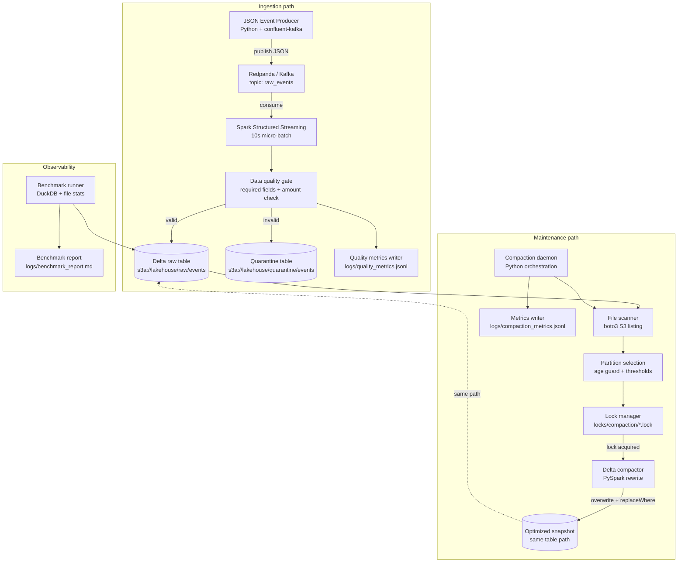

# Architecture — Tiered Data Lakehouse Compaction Engine

This document describes the system design for a streaming lakehouse with background table maintenance. It is written for engineers reviewing the repository, preparing for interviews, or extending the project toward production.

---

## 1. System overview

The system ingests JSON events from Kafka, lands them in a Delta Lake table on S3-compatible storage, and runs a background compaction service that remediates the **small-file problem** created by micro-batch streaming writes.

**Problem:** Spark Structured Streaming appends one or more Parquet files per micro-batch. With a 10-second trigger interval, a single hourly partition can accumulate dozens or hundreds of tiny files. Query engines pay a fixed cost per file (metadata, open, read planning), so file count directly impacts latency and cost.

**Solution:** A Python compaction daemon scans the Delta table on a schedule, identifies partitions with too many small files, rewrites them into ~128 MB optimized files, and commits through Delta Lake ACID transactions. Concurrent readers are not blocked because Delta uses MVCC — they continue reading the previous snapshot until the new one is atomically published.

**Runtime stack (local demo):**

| Layer | Technology |
|-------|------------|
| Message bus | Redpanda (Kafka-compatible API) |
| Stream processing | Spark 3.5 Structured Streaming |
| Table format | Delta Lake 3.1 |
| Object storage | MinIO (S3-compatible) |
| Compaction | Python daemon + PySpark |
| Benchmarking | DuckDB (reads Delta/Parquet directly) |
| Orchestration hooks | CLI exit codes for Airflow / cron / Dagster |

The architecture separates **ingestion** (continuous, append-only) from **maintenance** (periodic, partition-scoped rewrite). That split is how most production lakehouses operate at scale.

---

## 2. Architecture diagram



**Key invariant:** Ingestion and compaction both target the same logical Delta table path. Compaction does not copy data to a separate table — it publishes a new table snapshot with fewer, larger files for the rewritten partition(s).

---

## 3. Component responsibilities

### Producer

**Location:** `src/producer/`

Generates synthetic JSON events (user activity, transactions) and publishes them to the `raw_events` Kafka topic via `confluent-kafka`. Optionally injects bad records (`BAD_EVENT_RATE`, default 2%) to demonstrate the quarantine path.

**Responsibilities:**
- Serialize events as UTF-8 JSON
- Publish at a configurable rate for demo throughput
- Inject malformed payloads for data-quality testing

**Does not:** Write to Delta directly. It is a source system simulation.

---

### Kafka (Redpanda)

**Infrastructure:** `docker-compose.yml` → `redpanda` service

Durable, ordered log between producer and Spark. Redpanda is used locally because it is Kafka API-compatible without Zookeeper, which keeps the Docker footprint small.

**Responsibilities:**
- Buffer events between producer and consumer
- Provide consumer offsets for Spark checkpoint recovery
- Decouple write rate from processing rate

**Topic:** `raw_events` (auto-created)

---

### Spark Streaming job

**Location:** `src/streaming/spark_streaming_job.py`

Structured Streaming consumer that reads Kafka, parses JSON, validates records, and appends to Delta tables.

**Responsibilities:**
- Read from Kafka with a 10-second processing trigger (intentionally aggressive to produce small files)
- Parse JSON with a permissive schema so bad records can be routed, not dropped silently
- Derive partition columns: `event_date`, `event_hour`
- Route valid records → raw Delta table; invalid → quarantine table
- Persist checkpoints to `s3a://lakehouse/checkpoints/raw_events` for fault-tolerant at-least-once delivery (idempotent append + validation; not a formal exactly-once guarantee)
- Emit per-batch quality metrics

**Data quality checks** (`src/streaming/data_quality.py`): `event_id`, `user_id`, `account_id`, `event_type`, `event_timestamp` required; `amount` must be numeric and non-negative when present.

---

### Delta raw table

**Path:** `s3a://lakehouse/raw/events`

The system of record for valid ingested events. Stored as Delta Lake on MinIO:

- **Parquet** files hold columnar data, Hive-partitioned by `event_date` / `event_hour`
- **`_delta_log/`** holds JSON transaction commits — the source of truth for which files are live

Readers (Spark, DuckDB, compaction) resolve the current snapshot from the log. Physical files in S3 are never the authority on their own.

---

### Compaction daemon

**Location:** `src/compactor/compaction_daemon.py`

Orchestration layer for table maintenance. Designed for schedulers (cron, Airflow, Kubernetes CronJob).

**Responsibilities:**
- Run on an interval (`COMPACTION_INTERVAL_SECONDS`, default 3600) or one-shot (`--once`)
- Verify the Delta table exists before scanning
- Delegate partition discovery to the file scanner
- Apply selection policy (age guard + file-count rules)
- Acquire locks, invoke PySpark compaction per eligible partition
- Release locks in `finally` even on failure
- Aggregate run metrics and write JSONL output
- Return orchestrator exit codes: `0` success, `1` failure, `2` no eligible partitions

**Modes:** `--daemon`, `--once`, `--dry-run`, `--partition <id>`

---

### Lock manager

**Location:** `src/compactor/lock_manager.py`

Advisory, partition-scoped coordination stored in object storage.

**Lock path:** `locks/compaction/{partition_id}.lock`

Example: `locks/compaction/event_date=2024-06-11/event_hour=12.lock`

**Lock payload (JSON):** `partition_id`, `owner_id`, `acquired_at`, `expires_at`, `run_id`

**Responsibilities:**
- Prevent two workers from compacting the same partition concurrently
- Detect and remove stale locks (`expires_at` in the past)
- Support local filesystem locks for unit tests; S3/MinIO in production-like runs

**Important:** Locks prevent duplicate *effort*. Correctness comes from Delta ACID overwrite semantics, not from the lock itself.

---

### Metrics writer

**Location:** `src/compactor/metrics.py`, `src/streaming/quality_metrics.py`

Structured observability without a metrics server (appropriate for a portfolio demo).

**Compaction metrics** (`logs/compaction_metrics.jsonl`):
- Run ID, duration, partitions scanned / eligible / compacted / skipped
- Files and bytes before vs after per partition
- Lock conflicts, failed partitions, dry-run estimates

**Quality metrics** (`logs/quality_metrics.jsonl`):
- Per micro-batch valid / quarantined counts and rejection reason breakdown

Both use JSONL for easy `jq` / notebook analysis and future ingestion into Prometheus or a data lake.

---

### Benchmark runner

**Location:** `src/benchmark/benchmark_queries.py`

Measures the operational impact of compaction using DuckDB against the Delta table.

**Responsibilities:**
- Count files and total bytes under the table prefix
- Run representative filter queries (by `user_id`, date range, aggregations)
- Record latency before and after compaction (`make benchmark-before` / `make benchmark-after`)
- Generate `logs/benchmark_report.md` with side-by-side comparison

This component exists to make the small-file problem **measurable**, not just theoretical.

---

## 4. Data flow

End-to-end path from event creation to benchmark:

```
Event creation
    │
    ▼
Kafka (raw_events topic)
    │  durable buffer; consumer offsets tracked
    ▼
Spark parsing + validation
    │  JSON → typed columns; partition keys added
    │  valid → raw table  |  invalid → quarantine
    ▼
Delta write (append)
    │  new Parquet file(s) per micro-batch
    │  _delta_log commit publishes snapshot
    ▼
Compaction scan (scheduled / on-demand)
    │  boto3 lists objects; groups by partition
    │  counts small files (< 32 MB) and total files
    ▼
Partition selection
    │  skip if written within last 30 min
    │  eligible if > 20 small files OR > 100 total files
    ▼
Lock acquire → optimized rewrite
    │  PySpark read partition
    │  repartition toward ~128 MB files
    │  sort by user_id, account_id, event_timestamp (Z-order inspired)
    │  Delta overwrite + replaceWhere(partition predicate)
    ▼
Delta commit (new snapshot)
    │  old files marked obsolete in log; readers on old snapshot unaffected
    ▼
Benchmark
    │  file count, bytes, query latency before vs after
    ▼
Report (benchmark_report.md)
```

**Compaction cycle (per partition):**

1. File scanner returns `PartitionStats` (file count, small-file count, total bytes, last modified).
2. Selection policy returns eligible partitions or skip reasons (`too_recent`, `healthy`, `empty`).
3. Lock manager attempts acquire; on conflict, partition is skipped and counted.
4. `estimate_output_file_count()` computes target file count from total bytes ÷ 128 MB.
5. Delta compactor rewrites and commits; metrics writer records before/after stats.
6. Lock released in `finally`.

---

## 5. Design decisions

### Why Delta Lake

Delta Lake adds an ACID transaction log on top of Parquet in object storage. That matters for compaction because:

- **Atomic partition swap:** `overwrite` + `replaceWhere` commits a new file set for one partition in a single transaction.
- **MVCC for readers:** Queries pinned to snapshot N keep working while snapshot N+1 is written.
- **No manual S3 deletes:** Removing files only through the log prevents corrupting readers still on older versions.
- **Ecosystem fit:** Native integration with Spark Structured Streaming for append and PySpark for maintenance.

Alternatives like raw Parquet on S3 lack safe concurrent rewrite semantics without building custom locking and manifest management.

### Why partition-level compaction

Full-table compaction is slow, expensive, and blocks maintenance progress when one slice fails. Hourly partitions (`event_date` + `event_hour`) provide:

- **Bounded blast radius** — a failed job affects one hour of data, not the entire table
- **Parallelism** — multiple partitions can be compacted in separate runs (with per-partition locks)
- **Streaming coexistence** — other partitions continue receiving appends during rewrite
- **Predictable cost** — scan and rewrite work scales with partition size, not full table history

This mirrors how Databricks `OPTIMIZE` is typically run with `WHERE` clauses in production.

### Why MinIO locally

MinIO implements the S3 API on a laptop or CI-free Docker stack. The same code paths (`s3a://`, boto3, path-style access) transfer to AWS S3 with endpoint and credential changes only. For a portfolio project, MinIO avoids cloud cost, IAM setup, and network dependency while preserving realistic object-storage semantics.

### Why lock files

Multiple compaction triggers can overlap: scheduled daemon, manual `--once`, container restart after crash. Without coordination, two workers would:

- Waste Spark cluster resources on the same partition
- Race on overwrite timing (last writer wins, but both do full rewrites)

Advisory locks in object storage are simple, inspectable (JSON files you can `mc cat`), and require no extra infrastructure like Redis or Zookeeper. Stale lock expiry handles worker crashes without operator intervention.

### Why skip recent partitions

The age guard (`PARTITION_AGE_SKIP_MINUTES`, default 30) skips partitions modified recently. Streaming may still be appending files to the current hour. Compacting an actively written partition causes:

- **Write amplification** — compact, then immediately receive new small files
- **Race conditions** — overwrite may conflict with in-flight appends (mitigated by Delta, but wasteful)
- **Incorrect eligibility signals** — file counts change during the rewrite

Skipping hot partitions is standard practice; compaction targets "settled" slices.

### Why target 128 MB files

128 MB is a widely used target in lakehouse operations (Databricks documentation often cites 100–256 MB range). Rationale:

- **Parquet row groups** — larger files allow bigger row groups → better compression and column pruning
- **S3/listing economics** — fewer objects reduce LIST calls and Spark driver planning overhead
- **Spark default parallelism** — aligns with HDFS block size conventions and shuffle partition sizing heuristics
- **Diminishing returns** — files above ~256 MB improve little but increase memory pressure on readers

The daemon computes `ceil(total_bytes / 128MB)` output files via `estimate_output_file_count()` and repartitions accordingly.

---

## 6. Failure scenarios

### Compactor crashes mid-run

| Phase | What happens | Recovery |
|-------|----------------|----------|
| Before lock | No side effects; next run retries | Automatic |
| After lock, before commit | Lock remains until `expires_at`; partial new files may exist but are not in the log | Stale lock cleanup on next cycle; Delta ignores uncommitted files |
| After commit | Partition is optimized; lock should be released in `finally` | If process killed before `finally`, stale lock expires |

Delta ACID ensures readers never see a half-committed partition. The lock TTL (`LOCK_TIMEOUT_SECONDS`, default 3600) bounds how long a crashed worker blocks retry.

### Streaming job writes while compaction runs

- **Other partitions:** Unaffected. Appends proceed normally.
- **Same partition (recent):** Should be skipped by age guard. If not skipped, Delta `replaceWhere` overwrites only that partition's predicate; concurrent append to the same partition is resolved by Delta's transaction ordering — last commit wins for overlapping writes, which is why the age guard exists.
- **Readers:** Continue on pre-compaction snapshot until rewrite commits.

### Two compactors start together

1. Worker A acquires `locks/compaction/event_date=…/event_hour=….lock`.
2. Worker B sees non-expired lock → skips partition, increments `lock_conflicts` in metrics.
3. Worker A compacts and releases lock in `finally`.

No data corruption; worst case is duplicated effort if a stale lock was incorrectly cleaned (mitigated by conservative TTL).

### Bad records enter Kafka

The streaming job validates every message:

- **Malformed JSON** → quarantine with `malformed_json`
- **Missing required fields** → quarantine with specific reason (`missing_event_id`, etc.)
- **Invalid amount** → quarantine with `invalid_amount`

Bad records never reach the raw table. Quality metrics JSONL tracks rejection rates per batch. The producer's `BAD_EVENT_RATE` injects bad events for demonstration.

### MinIO unavailable

| Component | Behavior |
|-----------|----------|
| Producer | Unaffected (Kafka still accepts messages) |
| Spark Streaming | Micro-batch fails; retries per Spark checkpoint policy; may stall with checkpoint errors |
| Compaction daemon | `verify_delta_table_exists` or S3 listing fails → run exits with code `1`, error logged to metrics |
| Lock manager | `ClientError` on get/put → acquire fails; partition skipped or run fails |

Production deployments would add retries with backoff, alerting on sustained S3 error rates, and multi-AZ bucket redundancy.

---

## 7. Limitations

This repository is a **local, Docker-based demonstration** — not a production AWS deployment.

| Area | Current state | Production gap |
|------|---------------|----------------|
| Cloud | MinIO on localhost | AWS S3, IAM roles, VPC endpoints, KMS encryption |
| Kafka | Single Redpanda node | MSK / Confluent Cloud, multi-broker, ACLs |
| Spark | Local or dockerized Spark master | EMR, Databricks, or Kubernetes operators |
| Clustering | Sort-based Z-order **approximation** | Databricks `OPTIMIZE ZORDER` or similar proprietary engines |
| Locks | JSON files in S3/MinIO | DynamoDB conditional writes, Redis Redlock, or orchestrator exclusivity |
| Metrics | JSONL files on disk | Prometheus, Grafana, OpenTelemetry, PagerDuty |
| Security | Default MinIO credentials | Secrets Manager, TLS, network policies |
| Scale testing | Synthetic producer | Billions of rows, terabyte partitions, cost modeling |

The compaction logic and Delta semantics are production-*shaped*; the infrastructure is intentionally minimal so the project runs on one machine.

---

## 8. Future improvements

### Orchestration — Airflow / Dagster

The daemon already exposes CLI modes and exit codes suited for schedulers:

- **Airflow:** `BashOperator` with `--once`; branch on exit code `2` (no work) vs `0` (success)
- **Dagster:** `@op` wrapping compaction with partition sensors driven by metrics JSONL
- **Sensors:** Trigger compaction when `small_file_count` in metrics exceeds a threshold

### Observability — Prometheus / Grafana

Export compaction metrics (duration, files reduced, lock conflicts) via a `/metrics` endpoint or sidecar that tails JSONL. Dashboard panels: partition health heatmap, compaction lag, quarantine rate.

### Compute — AWS Glue / EMR

Move PySpark compaction off a single container onto managed Spark:

- **EMR on EKS** or **Glue Spark jobs** for partition rewrite
- **Glue Crawler** or **Unity Catalog** for table registration
- Spot instances for maintenance workloads

### Table format — Apache Iceberg

Iceberg offers similar ACID and hidden partitioning with different compaction verbs (`rewrite_data_files`). A parallel compactor implementation would demonstrate format-agnostic maintenance patterns.

### Data quality — Great Expectations

Replace inline Spark validations with GE suites:

- Expectation artifacts checked into the repo
- Validation results written to S3 and surfaced in Data Docs
- Quarantine routing driven by GE failure actions

### Lineage and catalog — DataHub / OpenLineage

Emit OpenLineage events from Spark and the compaction daemon (inputs: partition path, outputs: new snapshot version). Register datasets in DataHub for discoverability and impact analysis when compaction rewrites partitions.

---

## Related documentation

- [README](../README.md) — setup, Makefile commands, troubleshooting
- [Recruiter Overview](RECRUITER_OVERVIEW.md) — skills map and 5-minute demo script
- [Benchmark Report](BENCHMARK_REPORT.md) — methodology and sample results
- [Example outputs](../logs/examples/) — committed metrics, benchmark report, sample events
- [tests/README.md](../tests/README.md) — unit test suite (no Docker required)
- [CI workflow](../.github/workflows/ci.yml) — lint, typecheck, pytest on every push

---

## Interview talking points

1. **Small files are an operational consequence of streaming, not a design flaw** — you need maintenance alongside ingestion.
2. **Delta MVCC + partition-scoped overwrite** lets you compact without downtime.
3. **Advisory locks + TTL** coordinate workers; Delta provides correctness.
4. **Age guard** avoids racing with live writers on hot partitions.
5. **128 MB target** balances query performance, compression, and object count.
6. **Quarantine path** shows you think about data quality at the lake boundary, not just happy-path ingestion.
